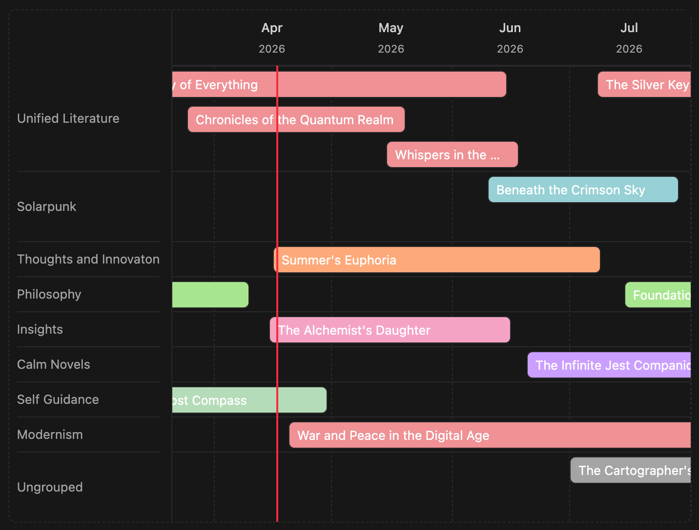
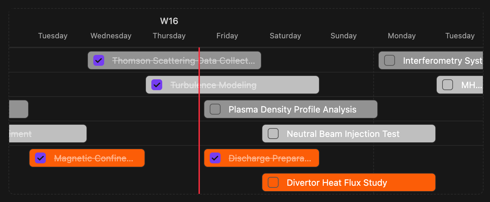
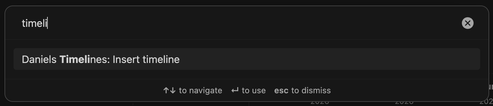
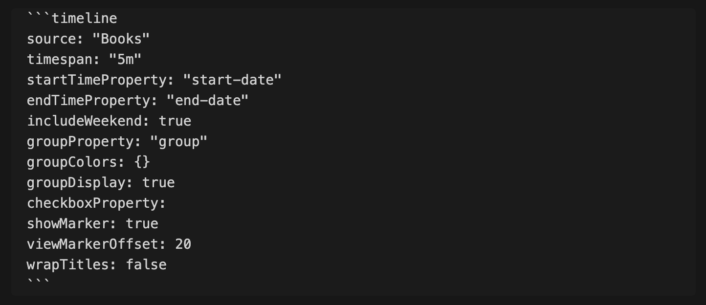
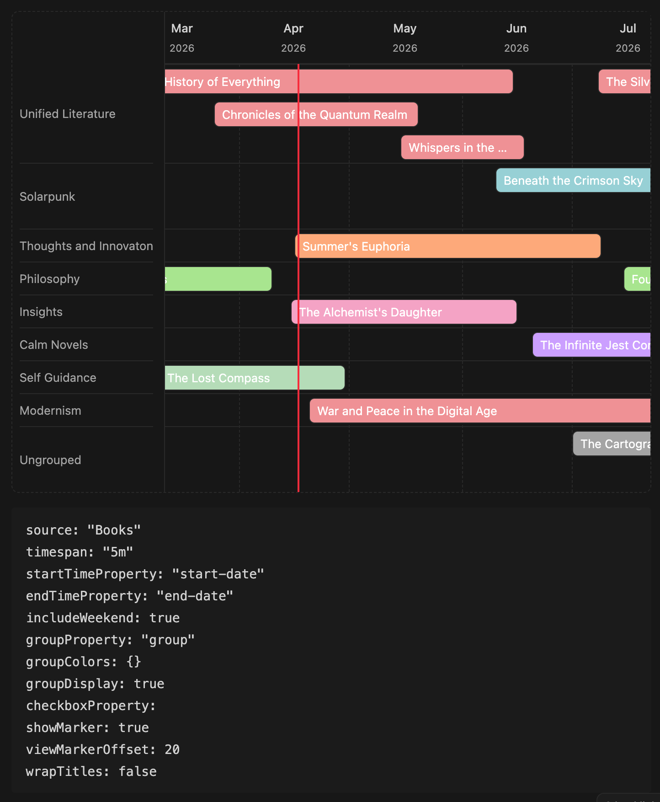
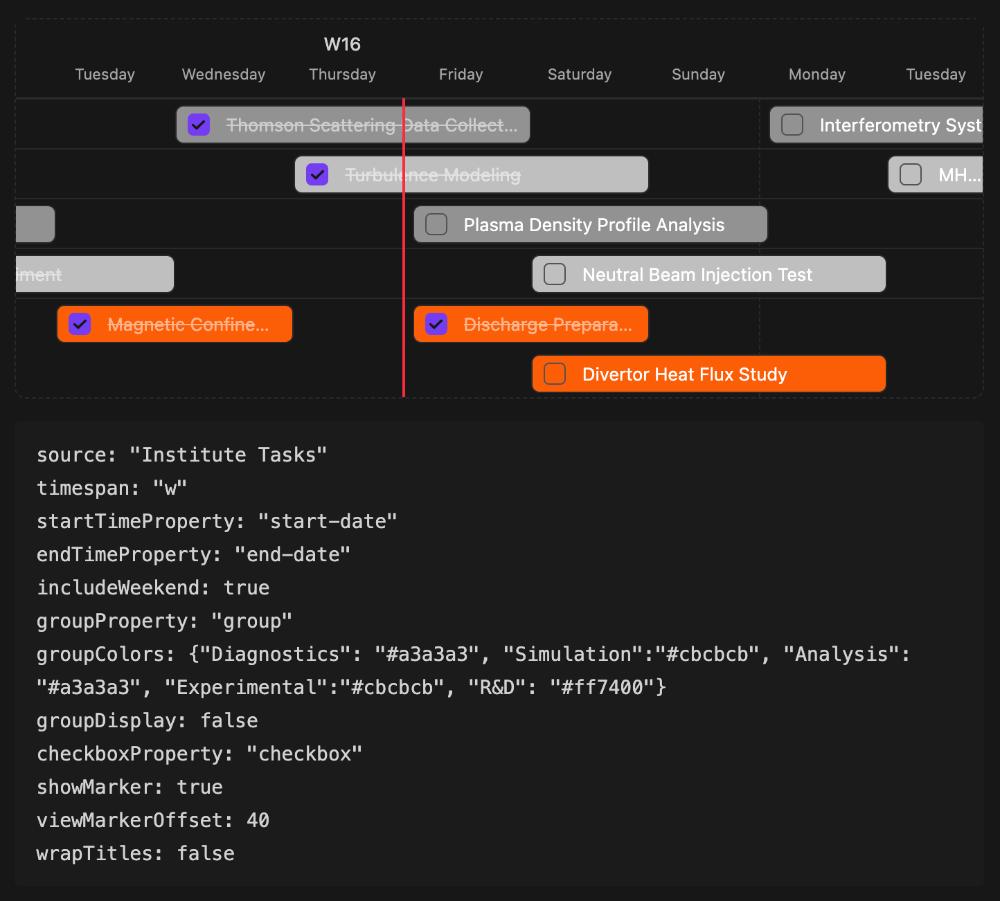

# Daniel's Timelines

Unify your oversight over time-dependent notes with intuitive timelines that support dynamic timespans, custom frontmatter properties, colours, and checkboxes for to-do's.

## Showcase
Timelines are customisable and use native styling by design. Dark and Light mode are supported.

## How to Install
Download the `/daniels-timelines` repository from GitHub and deposit it as folder within your Obsidian vault under `{Vault Name}/.obsidian/plugins/`. Then, enable the plugin within the Community Plugins section, where it should by now already show as installed.

If the Obsidian-team approves this plugin, it will be available in the Community Plugins browser within Obsidian. 

## Documentation
After activation, your timeline view can be created by either typing out an inline code-block of type "timeline" manually, or issuing the quick insertion of a ready template using the "Insert Timeline" command that comes with the plugin. 

### Properties
You can orchestrate the timeline-view to fit your exact requirements with its available properties. Here's a brief overview of them

#### Required Properties

- `source [string]` Dictates the directory path whose notes will be sourced by the timeline. All files within will be displayed.
- `timespan [{n}{unit}]` The horizontal density of displayed notes. The definition follows the syntax `{n}{unit}` and uses conventional measures of time for `unit`:
    - `d` days
    - `w` weeks
    - `m` months
    - `y` years
- `startTimeProperty [string]` The string name of your notes common ISO starting date property. The timeline searches for this value in every note within the defined `source`
- `endTimeProperty [string]` The string name of your notes common ISO ending date property. The timeline searches for this value in every note within the defined `source`

#### Optional Properties
- `includeWeekend [bool]` Toggle the display of weekends. Only recommended to be used with `timespan` of one week or shorter.
- `groupProperty [string]` The string name of your note's common grouping property whose value groups them into shared lanes and colours. The frontmatter key must be of type string. **If unused, leave the property undefined** 
- `groupColors [json]` Assign custom colors to each displayed note group. For example: `groupColors: {"group-1": "#5b5fc7", "group-2": "#1a9e8f"}` will colour every note with the `groupProperty` value `group-1` with a blue (#5b5fc7) colour
- `groupDisplay [bool]` Toggle showing a sidebar with group labels pinned to the left.
- `checkBoxProperty [string]` The string name of your note's common checkbox property. If this timeline property is defined, an interactive checkbox will be displayed within each rendered note on the timeline. Checking it, recursively acts on the note itself. **If unused, leave the property undefined** 
- `showMarker [bool]` Show red vertical "today" line
- `viewMarkerOffset [0-100]` Define the left offset of where the today marker sits on initial load. For reference: `0` = left edge, `50` = centred, `100` = right edge.
- `wrapTitles [bool]` Wraps labels instead of appending "..." to overflowing ones. (Enabling this can potentially offset the labels of the enabled `groupDisplay` property)

## Examples with Inline Code
For the properties explained above, let me show some examples. To see how the notes themselves can be formatted, view  example that I use myself. 
### First Example ( regular grouped view )

### Second Example ( minimal grouped weekly to-do, custom colors )

